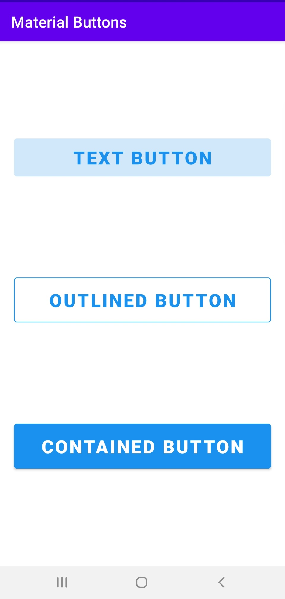
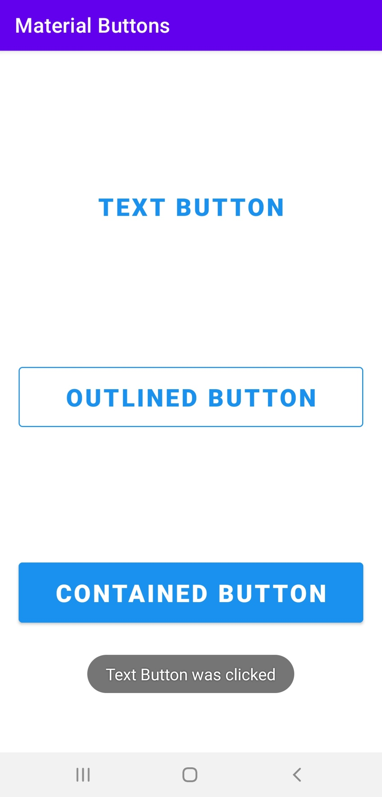
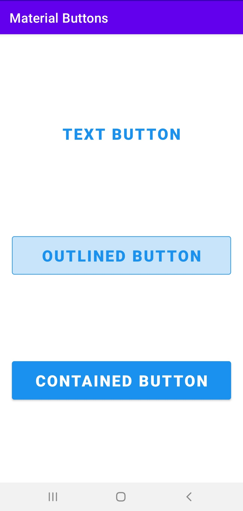
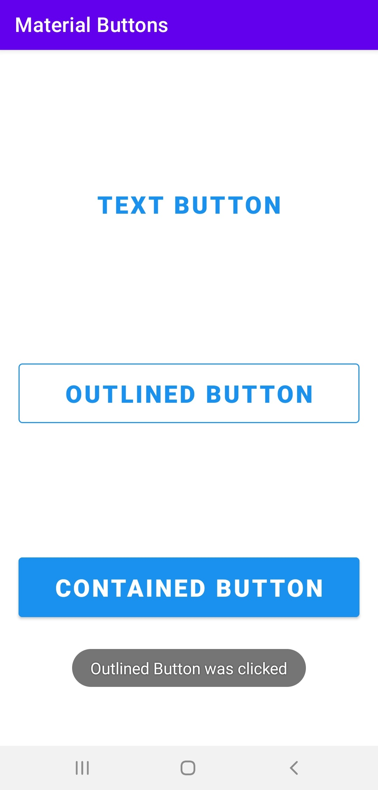

# Material-Buttons
To work with Buttons from Material Design Components.

### Screenshots of the App
<table>
  <tr>
    <td>  </td>
    <td>  </td>
    <td>  </td>
  </tr>
    <td>  </td>
    <td>  </td>
    <td>  </td>
  <tr>
  </tr>
</table>
